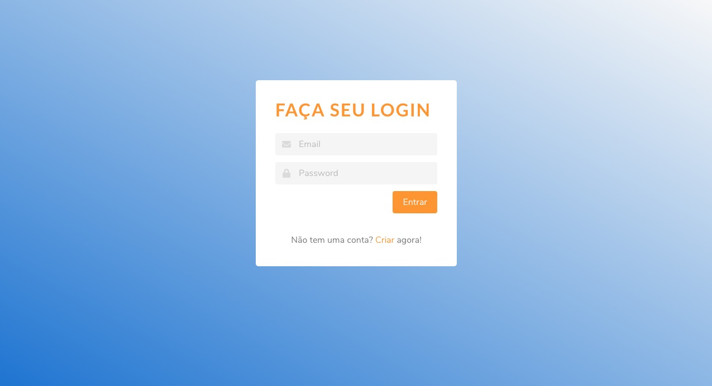
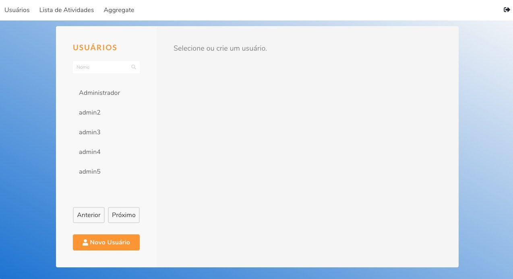
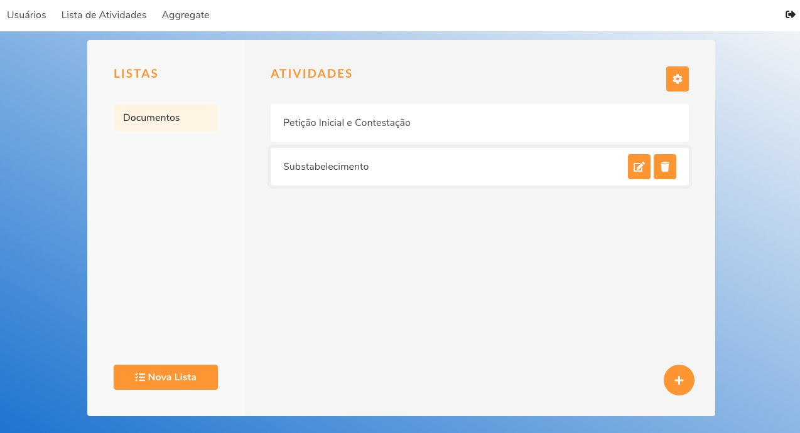
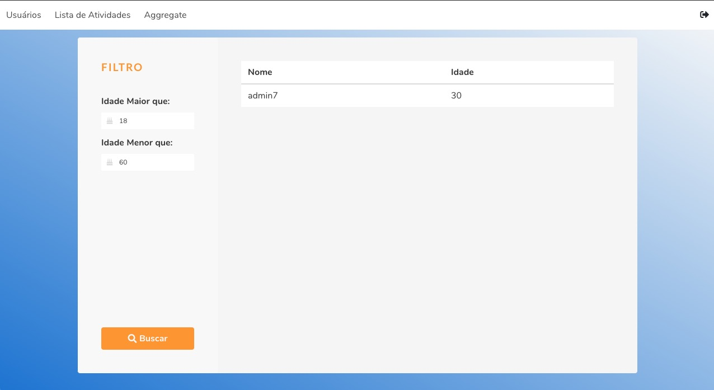

# Angular - Node.js

## Requisitos/Desafios:

- [x] Servidor Node.js | Express | MongoDB | Mongoose
- [x] Dados de usuário vinculados a outra informação
- [x] Usuários contendo: Nome | E-mail | Data de Criação
- [x] Frontend com Framework Angular s/ JQuery, consumindo API
- [x] POST /login :: Login com email e password e retornar um token de acesso
- [x] GET /me :: Rota para autenticar o token de acesso retornando os dados do usuário
- [x] GET /user:/:user_id :: Buscar os dados de um usuário em especifico
- [x] GET /users :: Buscar a lista de usuários com paginação
- [x] POST /user :: Adicionar um novo usuário
- [x] PATCH /user/:user_id :: Editar um usuário
- [x] DELETE /user/:user_id :: Remover um usuário
- [x] GET /user/filter :: Query Params
- [x] Todas as rotas precisam ser documentas no readme.md
- [x] Opção com 3 itens no pipeline do aggregate do Mongo
- [x] Rotas autenticadas pelo token de acesso (com exceção da rota "/me" e da rota "/login"), caso contrário o servidor deverá responder o status 403

## Rotas Backend
[Insomnia](./Insomnia.json)

### Usuários

- Criar | POST http://localhost.com/users
- Login | POST http://localhost.com/login
- Autenticar o token | GET http://localhost.com/me
- Listar todos (paginação) | GET http://localhost.com/users
- Listar (específico) | GET http://localhost.com/user/:user_id
- Buscar pelo nome | GET http://localhost.com/search
- Filtrar (aggregate) | GET http://localhost.com/filter
- Atualizar | PATCH http://localhost.com/user/:userId
- Deletar | DELETE http://localhost.com/user/:userId

### Listas

- Listar | GET http://localhost.com/lists
- Criar | POST http://localhost.com/lists
- Atualizar | PATCH http://localhost.com/lists/:listId
- Deletar | DELETE http://localhost.com/lists/:listId

### Atividades

- Listar | GET http://localhost.com/lists/:listId/tasks
- Listar todos de um Usuário (escífico) | GET http://localhost.com/tasks/:listId/tasks
- Listar uma específica | GET http://localhost.com/tasks/:taskId
- Criar em uma lista específica | POST http://localhost.com/lists/:listId/tasks
- Atualizar | PATCH http://localhost.com/lists/:listId/tasks/:taskId
- Deletar | DELETE http://localhost.com/lists/:listId/tasks/:taskId

## Rotas Frontend

- Entrar - http://localhost:4200/login
- Cadastrar - http://localhost:4200/signup
- Nova Lista - http://localhost:4200/new-list
- Editar Lista - http://localhost:4200/edit-list/:listId
- Listar todas - http://localhost:4200/lists
- Conteúdo de uma Lista - http://localhost:4200/lists/:listId
- Cadastrar Atividade - http://localhost:4200/lists/:listId/new-task
- Editar Atividade - http://localhost:4200/lists/:listId/edit-task/:taskId
- Usuários - http://localhost:4200/users
- Detalhar Usuário - http://localhost:4200/users/:userId
- Criar Usuário - http://localhost:4200/new-user
- Aggregate - http://localhost:4200/aggregate

### Screenshots

## 🎺 Pronto!